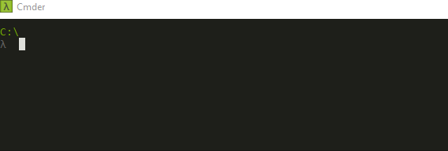

# psTrustedHosts

## Available on PowerShell Gallery

To install the [psTrustedHosts](https://www.powershellgallery.com/packages/psTrustedHosts/) module
run the following command in PowerShell:

    Install-Module psTrustedHosts -Force
    
## What Is It

*psTrustedHosts* is a PowerShell module that makes it easy to add, clear, get, and remove trusted hosts.

## What Can It Do

- **Add-TrustedHost**

  Adds one or more hosts. Specifically, it takes a an array of host names and converts it to a comma separated string and appends it to the value in WSMan:\localhost\Client\TrustedHosts.
  
  This command ensures that no duplicate host names are added.
  
- **Clear-TrustedHost**

  Clears all trusted hosts. Specifically, it sets WSMan:\localhost\Client\TrustedHosts to an empty string.
  
- **Get-TrustedHost**

  Returns a list of trusted hosts by splitting the value of WSMan:\localhost\Client\TrustedHosts on commas.
  
- **Remove-TrustedHost**

  Removes one or more trusted hosts. Specifically, it takes an array of host names and removes any occurrences of those host names from the value in WSMan:\localhost\Client\TrustedHosts.

## Auto-Complete Support

Both, `Get-TrustedHost` and `Remove-TrustedHost`, now support tab completion and IntelliSense (ctrl + space):

